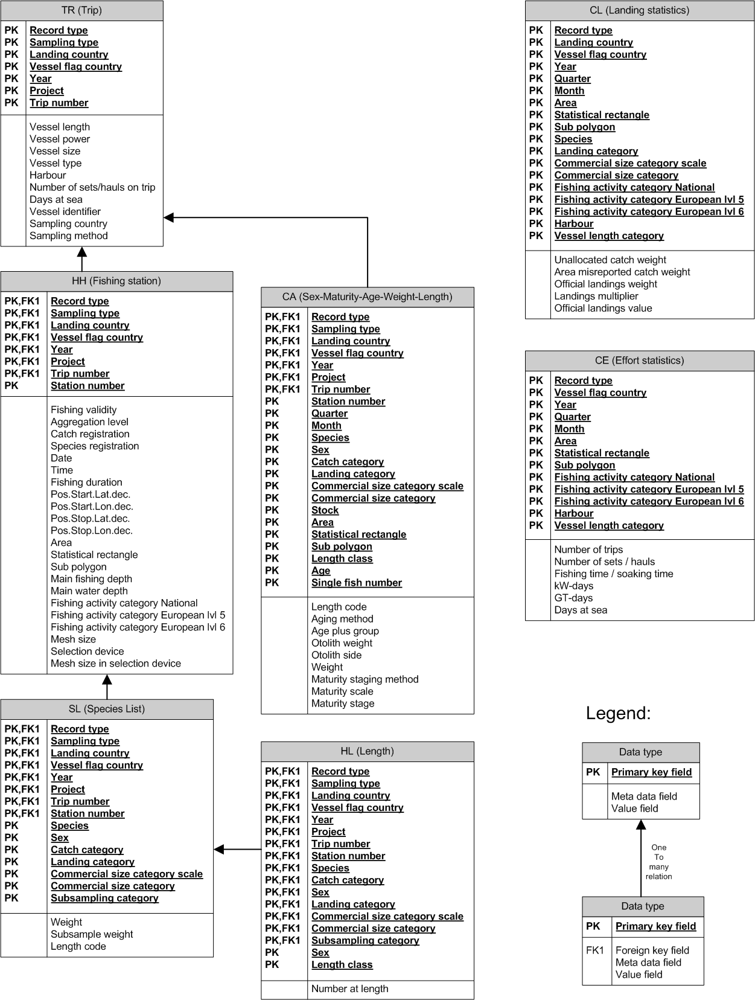

```{r, include = FALSE}
knitr::opts_chunk$set(
  collapse = TRUE,
  comment = "#>"
)
```

```{r compilnopack,eval=F,include=F}
```


This R package is dedicated to the construction of fishery-dependent data container objects. The mechanism to build up such containers is generic in order to facilitate the answers to the fishery-dependent data calls and to tackle the issues of providing the same information in different formats. The construction ensures intrinsically the quality of the data these objects contain. In this framework, we address the definition of data quality in the first part of this document. The document provides some practical examples of the construction of specific data containers.

# Framework

Fishery data are usually collected at the national level, following national working plans and using ad-hoc infrastructure and database format. Upon agreement, these data are then transmitted to the Regional Fishery Management organizations (RFMO). RFMO's data calls define the type of data countries have to provide, the form these pieces of information have to follow, the way how the data are transmitted and the deadlines.
 
## Fishery-dependent data
This document focus only on fishery-dependent data: data that are collected from the fishery, not the one collected during the scientific surveys or other activities not based on fishermen activities. A complete description of the information collectable from the fisheries is outside the scope of this document. This document will focus mainly on fishery characteristics (vessels characteristics, fishing areas, period of fishing, metiers used, fishing effort), the catches (landings and discards of the species), and the population descriptors of the catches: the numbers at length, the numbers at age and some biological parameters (maturity, sex...) by species.

## Data call
The fishery-dependent data are one of the inputs of stock assessment models. Besides this critical use, these data by itself provide information about the fisheries states and behaviours: a standard prerequisite to the understanding of the fishing pressures on the stock and its influence on the dynamics of the stock. The demands on fishery-dependent data by RFMO has increased in the past few years. For example, the data calls issuing by the International Council of the Exploration of the Seas (ICES) have increased by three for the stocks identified as data-limited in 2016 and 2017. For such stocks, the data provided has to cover three years instead of one, logically multiplying the processing time of the information by three. Moreover, differents RFMOs can ask for the same information in different formats. It is the case for the European Countries having fishing fleets in the Mediterranean Sea: both the General Fishery Commission of the Mediterranean (GFCM) and the Joint Research Center (JRC, a research institution belonging to the European Union) request the same fishery-dependent data for these countries but follow different data calls (deadline and file formats differ profoundly).
 
## Data quality
The quality of a dataset is a vague concept. A definition of this concept has to mix philosophical and practical considerations. Philosophy helps to understand the link between reality (the fishery activities and its impact on stocks) and the data representing this process. Floridi's paper (2005) discuss the link between semantic information and meaningful data in a general way. Practical considerations consider first the real use of the data collected. Wang and Strong (1996) define "data quality" as data that are fit for use by data consumers. Between these two extremes views, this document relies on the data quality framework proposed by the GFCM (GFCM, 2019). This choice does not tell that this framework is better than another one, but it has the merit to be a complete one available for fishery data. Data quality indicators, their definitions and the corresponding practical implementation are defined pages 82 and 83 of the document. They are seven indicators we redefined here in a broader sense:

- timeliness: data transmission meets the deadlines set by the RFMO,
- completeness:  all data transmitted contain all mandatory information
as required under relevant data calls,
- conformity: the data transmitted adhere to RFMOs standards (codification and format), 
- stability: the data transmitted  vary within acceptable limits compared
with the values of the same variables in the recent past,
- consistency: the data transmitted are coherent with the values of similar
variables reported in different data tables for the same reference year,
- accuracy: the data transmitted are close to a realistic or expected value (sampling coverage, precision and bias checks, outliers detection, change in methodology),
- adequacy: the data transmitted allow relevant RFMO subsidiary bodies to provide scientific advice related to the stocks under consideration.

The timeliness, completeness and adequacy indicators will be not considered in this document. Their assessments are particular to the data calls and ask for extra information not belonging to the construction of the data container. However, considering the "fit for use" proposed by Wand and Strong (1996), they are probably the most important in term of quality: if no, partial or inadequate data are provided to answer a data call, what is the meaning of the related data collection?  
The conformity, stability, consistency and accuracy indicators are data quality indicators which can be verified during the elaboration of the data at the national level. In these indicators, the conformity is an indicator intrinsically linked to the data container. For example, the conformity data quality indicators who checks if a landing value is a positive number, means that the column of the data table containing the landing value has to be defined as a positive number. If the data container of this data table is well defined, nothing else than a positive number can be entered by the user for this variable. 
This document will focus on the construction of data containers conform by definition. Shorter examples will illustrate the implementation of some of the three other indicators (stability, consistency and accuracy). These indicators are less critical in term of data quality. Stability indicator signals a drastic change of a parameter, but this change can be a real change in the fishery dynamic. This indication can be interesting to point out for the end-user, as stock assessments models can be sensitive to a significant variation in their input, but per se we consider stability as a secondary step in data quality assessment. The consistency indicator is dependent on the format of the data calls. It has to be checked in the data calls where redundant information is requested. For example, if catches, landings and discards are all requested, the total catches have to be equal to the sum of the total landings and the total discards. This example seems to be trivial, but at the national level, the data calls answers can involve different institutes (to complete the previous example, institute A providing the discards estimates, and institute B the census of the landings), and this kind of check is rarely done across different institutes.
The accuracy indicator covers a large body of practice in statistics. As the stability indicator, its implementation can lead to false positive, because the definition of what is a realistic value of fishery parameters in the context of a given data call is open to discussion. However, like stability, this indicator can inform the user to some errors or change in the fishery or stock dynamic, and but per se we consider accuracy as a secondary step in data quality assessment.
   
## Data format in fishery science
The need to have a versatile tool able to build different data container for the same information relies on the multiplicity of the data format requested by the RFMOs. A data format is a formal definition of how the data are transmitted to the RFMOs. The definition includes the files format and the codification of the data in these files. For European Countries, according to the distribution of the stock their fleets target, a short list could be:

- ICES Fishframe format, ICES Intercatch format, JRC Fishery Dependent Information (FDI) for North-Atlantic stocks,
- GFCM data format, JRC Fishery Dependent Information (FDI) format for Mediterranean stocks,
- ICCAT data format for Atlantic tunas stocks,
- IOTC data format for Indian Ocean tunas stocks,
- FAO data format for fishery data production.

Other RFMOs exist (CCAMLR, SPF...) and are not considered here, as they are less concerned by European fleets.
The main RFMOs (ICES, JRC, GFCM) for the European countries lead to the manipulation of at least 4 data format to answer the regular data call. All these formats are documented:

- RDB Fishframe: Jansen et al. (2016) then ICESb (2018),
- Intercatch: ICES (2018c),
- FDI: JRC (2019),
- DCRF GFCM: GFCM (2019).

An interesting common feature of these documents is their evolution in time. All of them have experienced during the past three years (FDI, GFCM) or are experiencing significant changes (ICES). These significant changes regard the basic structure of the files exchanged with the countries, and on a less critical level, these changes also concern the definitions of the reference list of some individual parameters. As an example, the interested reader can compare the data structure described in Jansen et al. (2016) with the one in development in ICES 2018a.

To conclude this short view on the fishery-dependent data, the increasing of the data calls and the instability on the data formats requested by the RFMO highlight the need to develop a tool able to cope with these constraints, with the guarantee of ensuring the quality of the data transmitted to the RFMOs.

\newpage

# Rationale

The construction principle of fishery-dependent data containers is illustrated using the Fishframe data format (see Fig. 1 from Jansen et al. 2016). 



\newpage

The careful inspection of this current format highlights essential properties:

- the information is often located in space: the table `trip` locates the trips in their landing harbours (variable `harbour`), the table haul locates the fishing haul three times (by its geographical coordinates, the ICES `Statistical rectangle` and the ICES `Area`)...
- the information is located in time: fishing trips by year, fishing stations by year, date and time, landings statistics by year, quarter, month...
- Some fishery objects have their own coherency: a fishing vessel is defined by its flag (this information is repeated in all the commercial sampling table in our example), its physical properties (length, size...). A fishing station is defined by the metier referenced three times in the fishing station tables...

These comments apply to other RFMOs data formats. In summary, time and space references are essential information, and other fishery objects information (fishing vessel description, characteristics of a haul, sampling reference) are requested by all the data calls. Inside each data calls, the labelling and the aggregation of the information can change. For example, the temporal unit of GFCM data call is the year, while for ICES Intercatch related data it can be the month, the quarter or the year. For fixed information, the codification can change while the parameter conveys the same information. The metier lists are not the same for ICES, GFCM or FDI data call but a trawler of 25 meters long remains the same trawler even if its name is OTB_DEF_70-99_0 for ICES, T12 for GFCM and TRAWL/OTB/70D100 for the FDI data call. 

Considering these properties, the main task to translate national data to data calls (apart from the estimation work that this document do not address) is a translation work in time and space plus a renaming of the information properties using a different convention. To do this, this package provides some generic data containers for time, for space and for general fishery object. 
These data containers embed some strict definition of the data types and ensure the conformity of the information intrinsically.

## Data containers and S4 R class

The data containers are build using S4 class objects. Advanced knowledge of R and an understanding of the oriented-object OO programming can be helpful to understand the way the data containers are built and translated into data files conform to the data-calls specification. The book of H. Wickham (2014) covers all these topics.
The S4 objects in R have fundamental properties related to the fishery data container: they have a formal definition to ensure conformity and inheritance properties who simplify the construction of complex data containers. 

## Information
The data container has to record information at its smallest resolution. If a trip is located in space by the vessel trajectory, the data container will contain this trajectory. If for another trip, only the ICES division is known, then this information is recorded in the data container. This consideration is the same for the time, and for all the other fishery information: one record by parameters at the smallest resolution possible. The R classes and objects will then ensure the translation of the data into the data-calls requirements using methods and transparent reference lists and algorithms. 


\newpage

# The elementary classes
The classes identified as elementary are presented in the next section. They are implemented in the present package, but their implementation is subject to change according to the user needs and the data-calls scopes. We believe that the `Time` and the `Space` classes are generic enough to be needed across every data calls. 

The library is then loaded:

```{r setup}
library(CLEFRDB)
```
\newpage

## The `Time` class

Temporal references are defined by a type (`TimeType`) and a date (`TimeDate`).
```{r time1}
new("Time")
```
The type provides the temporal resolution at which the information is recorded,
and the date the central date following the `POSIXct` format of the temporal event. 
Five `TimeType` are available:
```{r time2}
print(Timetype)
```
corresponding respectively to annual, quarterly, monthly, daily and date with time events.

The definition of a `Time` object for a regular date (a nightly haul in May 2011 for example) is:

```{r time3,eval=T}
hauldate<-as.POSIXct(strptime("2011-03-27 01:30:03",
			   "%Y-%m-%d %H:%M:%S"))
new("Time",TimeType="date",TimeDate=hauldate)
```

Why adding such complex definition of a temporal event when adding column for year, month, day or quarter could be more straightforward ? For two reasons:

- having a `POSIXct` object guarantees the conformity of the date, and gives to the user the possibility to extract time informaiton using R methods without any error,
- this object carries all the redondant information sometimes requested by the data-calls.

To illustrate these properties, let see a simple example with a set of four differents temporal events recorded at different time scales:
```{r time4}
haultime<-c("2011-03-27 01:30:03",
	    "2011-03-27 12:00:00",
	    "2011-03-15 12:00:00",
	    "2011-02-14 00:00:00")
haultime<-as.POSIXct(strptime(haultime,
			   "%Y-%m-%d %H:%M:%S"))
haultime<-new("Time",TimeType=c("date","day","month","quarter"),
    TimeDate=haultime)
print(haultime)
```
The four hauls date are recorded respectively at the date, the day, the month
and the quarter scale. The corresponding dates are the dates at the middle of
the day, the month and the quarter.
If a data-call request date in year, the conversion is easy to compute:
```{r time5}
substr(haultime@TimeDate,1,4)
```
More complex time manipulations are available using the `lubridate` R package.

### Data quality

The conformity of the `Time` object is checked during the object construction. 
A `Time` class object is checked:

- `TimeDate` has to be `POSIXct`,
- `TimeType` has to be a character vector and presents in the `Timetype` object,
- the lengths of the two vectors have to be equal,
- no empty values allowed.

These commands will generate an error:
```{r time6,eval=F}
new("Time",TimeDate=c(NA),TimeType=c("day"))
new("Time",TimeDate=.POSIXct(c(NA,NA)),TimeType=c("day","day"))
new("Time",TimeType="date",TimeDate="2011-03-27")
hauldate<-as.POSIXct(strptime("2011-03-27 01:30:03",
			   "%Y-%m-%d %H:%M:%S"))
new("Time",TimeDate=hauldate,TimeType=c("a day"))
new("Time",TimeDate=hauldate)
```
This behaviour is not user-friendly, but simply asks the user to be consistent
for a very simple field (time !). Adressing formatting error at the very
beginning of the data preparation is the best way to propagate conformity
quality inside a dataset.

### An example

If a data-call request a data table containing the time series of the total
landings.
The S4 object related to this demand can be defined using the `Time` class as the container
for the temporal definition, adding a new slot for the landings values. 
In this case, the new object class named `Landings` will
inherit the `Time` class properties. The conformity check and the other methods
belonging to the `Time` class will be transmitted to the new `Landings` object.
The function `initinherit` of this package copies the parameters from one object
to another based on their typology. For the `Landings` class containing the
`Time` class, the `Time` parameters will be copied inside the `Landings` object.

```{r time7,eval=T}
#a Time object related to four haul
        haultime<-c("2011-03-27 01:30:03",
		    "2011-03-27 12:00:00",
		    "2011-03-15 12:00:00",
		    "2011-02-14 00:00:00")
        haultime<-as.POSIXct(strptime(haultime,
				      "%Y-%m-%d %H:%M:%S"))
        haultime<-new("Time",TimeType=c("date","day","month","quarter"),
                          TimeDate=haultime)
# the value of the total landings of the four hauls
w<-c(10000,3000,2000,10)
#Definition of the Landings class
setClass(Class="Landings",
         slots=c("landings"="numeric"),
         contains=c("Time"),
         prototype=prototype(Landings=numeric(),
                             Time=new("Time"))
         )
#a new Landings object
new("Landings")
#a new Landings object initialized with the previous values
initinherit(new("Landings"),landings=w,Time=haultime)
```

## Space

The `Space` class follow the same class structure of the `Time` class.
Spatial references are defined by a type (`SpaceType`) and a place
(`SpatialPlace`).
```{r space1}
new("Space")
```
The type provides the spatial type at which the information is recorded,
and the place the name of the spatial area corresponding to the type
Both paramters are `character` vector
Four `SpaceType` are available:
```{r space2}
print(Spacetype)
```
corresponding respectively to the ICES division (e.g. 27.7.g), the ICES rectangle
(e.g. 50H6), the harbour in UNLOCODE (e.g. DEBRB) and the GSA area (e.g. GSA07).
The object `defspace` of class `sf` gives the spatial geometry of these differents spatial
entities using simple features ISO standard definition.

```{r space3}
head(defspace)
```

A plot of this object shows a map of all the geometry available.

```{r space4}
library(sf)
plot(defspace["type"])
```

The contruction of a simple `Space` object containing three spatial objects (one
ICES division, one GSA area and a harbour) is:

```{r space5,eval=T}
tripgeo<-new("Space",SpacePlace=c("27.7.h","GSA07","FRRTB"),
		  SpaceType=c("ICESdiv","GSA","harbour"))
print(tripgeo)
```
The `plot` method attached to the `Space` class map the geometry of the
resulting object:

```{r space6,eval=T}
plot(tripgeo)
```


### Vessel
### Haul
### Species
### Sampling

\newpage

# Bibliography

- Floridi, L. (2005). Is semantical information meaningful data? Philosophy and Phenomenological Research, LXX, pp. 351-370.
- GFCM (General Fishery Council for the Mediterranean), 2019. GFCM Data Collection Reference Framework (DCRF). Version: 2019.1. http://www.fao.org/gfcm/data/dcrf/
- ICES (International Council for the Exploration of the Seas), 2018a. Workshop on new data model for the Regional Database (WKRDB-MODEL), 15 –18 January 2018. `http://www.ices.dk/sites/pub/Publication%20Reports/Expert%20Group%20Report/acom/2018/WKRDB/wkrdb-model_2018.pdf`
- ICES (International Council for the Exploration of the Seas), 2018b. The Regional DataBase (RDB) Exchange Format. Version 1.314-August-2018. https://www.ices.dk/marine-data/data-portals/Pages/RDB-FishFrame.aspx
- ICES (International Council for the Exploration of the Seas), 2018c. 
InterCatch Exchange Format. Version 1.0. Document version 1.11. http://www.ices.dk/marine-data/data-portals/Pages/InterCatch.aspx
- Jansen, T., Degel, H., Vigneau, J. and Jardim, E. (2016) The Regional DataBase (RDB) Exchange Format. ICES Technical Report.
- JRC (Joint Research Center, European Commission, DG Maritime Affairs and Fisheries), 2019. https://datacollection.jrc.ec.europa.eu/dc/fdi
- Wang, Richard Y.  and Strong, Diane M., 1996. What data quality means to data consumers? Journal of Management Information Systems, Vol. 12, No. 4 (Spring, 1996), pp. 5-33.
- Wickham H. (2014) Advanced R. Chapman & Hall/CRC the R Series, 478 p. http://adv-r.had.co.nz/


